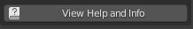

# Example Overview
Below you will find the actual documentation used in production. This was one of the more complex tools I created for production. It will create multiple LOD meshes with a few clicks. It is able to read through complex mesh heirarchies and also append the new LOD meshes using 3 different methods while respecting the original heirarchy. There are also multiple methods of mesh decimation.

The mechs for this project had three UV channels that were used for different skins and decals. This addon allows you to mask those vertices so they are not affected, which was useful for LOD1 since you could see still see these effects at the distance of the LOD switchover in game. 

I was able to figure out the screen space calculations in order to get the Blender viewport to match when Unity would switch LODs based on camera distance. This allows the user to never have to leave Blender as they get a 1 to 1 representation of what they would see in engine. The percentage settings could be copied to Unity's LOD components and everything would match or vice versa. A modal operator was built to be able to view the LOD switch over in real time. 

LOD3 was a special case where I procedurally generate new meshes instead of copying and decimating preexisting meshes to get the lowest triangle count possible. It uses shrinkwrap modifiers to better fit the form of LOD0 after mesh generation. It appears black in the GIF because there are no UV maps. In most cases we just did a quick unwrap and shrank the UV islands down inside the main texture afterwards.

There is a built in "remove all LOD data" function for trial and error purposes. This scrubs anything that was created and sets you back to square one in one click.

# Simu_LOD Help and Information
## Quick Links
- [Getting started](https://github.com/simutronics/Galahad/blob/master/3DArtTools/Blender/scripts/addons/Simu_LOD/READ_ME.md#getting-started)

    - [Add-on Installation Procedure](https://github.com/simutronics/Galahad/blob/master/3DArtTools/Blender/scripts/addons/Simu_LOD/READ_ME.md#add-on-installation-procedure)

    - [Panel Location, Versioning, and Help](https://github.com/simutronics/Galahad/blob/master/3DArtTools/Blender/scripts/addons/Simu_LOD/READ_ME.md#panel-location-versioning-and-help)

- [LOD Generation](https://github.com/simutronics/Galahad/blob/master/3DArtTools/Blender/scripts/addons/Simu_LOD/READ_ME.md#lod-generation)

    - [LOD0 Setup](https://github.com/simutronics/Galahad/blob/master/3DArtTools/Blender/scripts/addons/Simu_LOD/READ_ME.md#lod0-setup)

    - [LOD Children Setup](https://github.com/simutronics/Galahad/blob/master/3DArtTools/Blender/scripts/addons/Simu_LOD/READ_ME.md#lod-children-setup)

        - [LOD Manipulation Methods](https://github.com/simutronics/Galahad/blob/master/3DArtTools/Blender/scripts/addons/Simu_LOD/READ_ME.md#lod-manipulation-methods)

            - [Decimate Modifier Method](https://github.com/simutronics/Galahad/blob/master/3DArtTools/Blender/scripts/addons/Simu_LOD/READ_ME.md#decimate-modifier-method)
            - [Remesh To Low Poly Method](https://github.com/simutronics/Galahad/blob/master/3DArtTools/Blender/scripts/addons/Simu_LOD/READ_ME.md#remesh-to-low-poly-method)

        - [LOD Parenting Methods](https://github.com/simutronics/Galahad/blob/master/3DArtTools/Blender/scripts/addons/Simu_LOD/READ_ME.md#lod-parenting-methods)

            - [Root as Parent Method](https://github.com/simutronics/Galahad/blob/master/3DArtTools/Blender/scripts/addons/Simu_LOD/READ_ME.md#root-as-parent-method)
            - [LOD0 as Parent Method](https://github.com/simutronics/Galahad/blob/master/3DArtTools/Blender/scripts/addons/Simu_LOD/READ_ME.md#lod0-as-parent-method)
            - [Consecutive LOD Parents Method](https://github.com/simutronics/Galahad/blob/master/3DArtTools/Blender/scripts/addons/Simu_LOD/READ_ME.md#consecutive-lod-parents-method)

- [LOD View Settings](https://github.com/simutronics/Galahad/blob/master/3DArtTools/Blender/scripts/addons/Simu_LOD/READ_ME.md#lod-view-settings)

    - [LOD Visibility](https://github.com/simutronics/Galahad/blob/master/3DArtTools/Blender/scripts/addons/Simu_LOD/READ_ME.md#lod-visibility)

    - [LOD Camera Settings](https://github.com/simutronics/Galahad/blob/master/3DArtTools/Blender/scripts/addons/Simu_LOD/READ_ME.md#lod-camera-settings)

- [Active Object Modifier Settings](https://github.com/simutronics/Galahad/blob/master/3DArtTools/Blender/scripts/addons/Simu_LOD/READ_ME.md#active-object-modifier-settings)

    - [No Active Object State](https://github.com/simutronics/Galahad/blob/master/3DArtTools/Blender/scripts/addons/Simu_LOD/READ_ME.md#no-active-object-state)

    - [No Modifier State](https://github.com/simutronics/Galahad/blob/master/3DArtTools/Blender/scripts/addons/Simu_LOD/READ_ME.md#no-modifier-state)

    - [Decimate Modifier State](https://github.com/simutronics/Galahad/blob/master/3DArtTools/Blender/scripts/addons/Simu_LOD/READ_ME.md#decimate-modifier-state)

    - [Remesh Modifier State](https://github.com/simutronics/Galahad/blob/master/3DArtTools/Blender/scripts/addons/Simu_LOD/READ_ME.md#remesh-modifier-state)

- [Remove All LOD Data](https://github.com/simutronics/Galahad/blob/master/3DArtTools/Blender/scripts/addons/Simu_LOD/READ_ME.md#remove-all-lod-data)
            

# Getting Started
## Add-on Installation Procedure
1. Before installation make sure you have Blender 3.1 or later.
    - This can be found on [Blender.org's Download Page](https://www.blender.org/download/)

2. Open Blender and navigate to Edit>Preferences>File Paths.
    - Inside the Data section and in the Scripts directory path you will have to search and find the following directory inside the Simutronic's git repository that you have cloned to your PC:
        > \Galahad\3DArtTools\Blender\scripts\

        
4. Close all instances of the Blender application. This is **NOT** optional.

5. Reopen Blender and again, in Edit>Preferences navigate to Add-ons.
    - Search for Simutronics
    - Click the checkbox next to Simu_LOD to enable this add-on

Setup is now complete and you will only have to enable new add-ons by searching for Simutronics in the same fashion in the future. Add-on updating will happen as you sync with the git repository. The directory you added will house all future Blender add-ons.

## Panel Location, Versioning, and Help
In the 3D Viewport you will find a tab labled Simu_LOD. If you do not see any tabs, press the 'N' key on your keyboard to open up the tab sidebar.

 

The top-most button on the panel has a label that lists the current version of the add-on that is installed. This also functions as a button to check for add-on updates after you resync the git repository. Updating while Blender is running is completely fine.

The next button below will link to this READ_ME.md file that you are currently reading in case you need help.

# LOD Generation

## LOD0 Setup

All LOD Generation operator buttons are colored red. If you are creating LODs for new objects then you will be presented with a single option that will generate LOD0, which is just the same objects as before, but with **_LOD0** added to the end of the objects name.

In order to generate LOD0 you must select the mesh objects you wish to process for LOD generation. Select **ONLY** mesh objects. Any other object will cause the operator to fail.

>:large_blue_diamond: This is done so it is impossible to create LODs for non-mesh items like lights and cameras while allowing you to be selective on what you wish to process for LOD generation instead of processing all the mesh objects in the scene.

### To properly generate LOD0 do the following:

1. Select the **MESH** objects you wish to process. If working with a group of meshes that already have a hierarchy, you can easily select everything in that hierarchy by right-clicking on the upper-most parent object in Blender's Outliner and selecting **Select Hierarchy**

    

2. Press the red '**Setup LOD0 For Selected**' button. See the before and after images of what will change after pressing it.

    **Before:**

    

    **After:**

    

The **Setup LOD0 For Selected** button has automatically created a new collection named '**LOD Hierarchy**' and created an empty object named '**root_empty**' and has made that empty the root parent of the entire LOD hierarchy. Any pre-existing hierarchy is unaltered otherwise. The '**root_empty**' will be replaced by the FBX file name upon export.

Each preselected mesh object also is renamed with a new '**_LOD0**' suffix. The mesh data is also renamed to match the object that contains it.

If LOD0 generation is successful. The red button will be replaced with a new label with a checkmark icon.

The root_empty will automatically be hidden to avoid accidental selection for LOD Children generation.

The viewport overlays were also changed. The 3D Cursor is disabled to keep it from obstructing LOD viewing and Statistics has been enabled to keep track of LOD mesh densities. 

## LOD Children Setup

After LOD0 generation is completed the Simu_LOD UI will change to allow you to setup LOD children. Once you have selected your settings you will press the red '**Setup LOD Children**' button to have all the LOD children generated automatically.

>:large_blue_diamond: The same objects that were selected during LOD0 generation remain selected for quick LOD Children processing. The same LOD0 selection rules apply to LOD children generation. 

From the top, the first option in the UI is number field labeled '**Add/Remove LODs:**' that allows you to choose how many LOD children for each object that will be generated. Minimum is 1 and the maximum is 3.

Next you will see a LOD Settings area labeled '**LOD(LOD Number) Settings:**'. The number of areas you will see is dependant on the number you set in the '**Add/Remove LODs:**' field.

The way the '**LOD(LOD Number) Settings:**' area is displayed is dependant on the '**Method"**' selection.

 - ## LOD Manipulation Methods

    - ### Decimate Modifier Method
        - The Decimate Modifier method has two settings labeled '**UV Channel Masks:**' and '**Decimate Ratio:**'. 

            

            - Using this method creates a Decimate Modifier for each LOD child object as well as a Vertex Group for masking the modifier's ability to alter the mesh data.

            - '**UV Channel Masks:**' will display the maxium number of UV channels of all objects that was originally selected for LOD0 generation. In other words, if there are objects with only a single channel, but other objects have three, you will see a checkbox for three channels. 
                - Each checkbox will be labeled as '**UV(channel number)**'
                - Check the box for the UV channel you wish to exclude from the Decimate Modifier manipulation. This is useful for masking areas that need to remain unaltered in each LOD. 
            - '**Decimate Ratio:**' will display the ratio the modifier will use for decimation of the LOD object and is shown for convenience only. The ratio will always be adjustable later on in the LOD creation process.
                - LOD1 default: 0.50
                - LOD2 default: 0.15
                - LOD3 default: 0.05
                
            >:large_blue_diamond: The Decimate Modifier method is recommended for LOD objects that will have texture details and a mesh silhouette easily visible.
    - ### Remesh To Low Poly Method
        >:large_blue_diamond: This method will destroy UV mapping.
        - The Remesh To Low Poly method has no configurable settings since it makes more sense to be able to compare LOD levels before editing in this case.

            
        
            - Using this method will create a Remesh Modifier and a Shrinkwrap Modifier. The Shrinkwrap modifier will automatically use the corresponding LOD0 object as it's source.

            >:large_blue_diamond: The Remesh To Low Poly method is recommended for LOD objects that will be extremely small when active with details not easily seen. 

- ## LOD Parenting Methods
Below the LOD Settings areas is an area for selecting the type of parenting every LOD child will use once they have been generated.

- ### Root as Parent Method
     - Each LOD will all have the same root parent.

        

- ### LOD0 as Parent Method
     - LOD 1 through 3 will use LOD0 as it's parent

        

- ### Consecutive LOD Parents Method
    - LOD parents are ordered consecutively. For example, LOD0 is the parent of LOD1 while LOD1 is the parent of LOD2.

         

    >:large_blue_diamond: Selecting a parenting method will not alter any pre-existing hierarchy. See example using Root as Parent on a pre-existing hierarchy:

    

As stated earlier, once you have all of your configurations setup, you simply press the red '**Setup LOD Children**' button.

If LOD children generation is successful. The red button will be replaced with a new label with a checkmark icon.

# LOD View Settings

After the process of creating LOD0 and any child LOD, the Simu_LOD UI will change once again. 

## LOD Visibility

The area labeled '**LOD Visibility:**' is where you can toggle the visibility of each generated LOD number.

- Depending on how many LOD children were generated, you will have between 2 and 4 icons that can toggle the visibility of each LOD number.
- By default LOD0 is the only LOD toggled on after the generation process is completed.
- You are completely free to toggle any and all at any time as long as you're not using the '**Camera View**' mode.

## LOD Camera Settings

The area labeled '**LOD Camera Settings:**' is where you can toggle a mode that will show each LOD based on set screen space sizes in the viewport window. This process is matched to Unity's LOD viewing process.

- Depending on the number of LOD children, you will see between 1 and 3 percentage settings.
- Each LOD percentage setting is only configurable when the '**Camera View**' mode is not active.
    - LOD1 Default: 50
    - LOD2 Default: 15
    - LOD3 Default: 5

Once you click the '**Use Camera View**' button. The UI will be disabled for other settings. You are now in '**Camera View**' mode.

- Use the middle mouse wheel to zoom in and out. The LODs will switch visibility modes based on their size in the viewport window.
- You will also see a yellow label centered at the bottom of the viewport window that tells you which LOD number you're currently viewing.

    
- To return to normal viewing you have to click the same button again. It should be no longer colored blue and the visibility will automatically be set to displaying only LOD0. The yellow viewport label will also disappear.

    

# Active Object Modifier Settings

The '**Active Object Modifier Settings:**' area is where you will be able to manipulate the settings you had chosen during the LOD generation process. This area has 4 possible states and one possible sub-state.

>:large_blue_diamond: 'Active Object' refers to Blender's concept of active versus selected. The active object will always be the last object selected regardless of the object's current selection status. In other words, the active object can be be deselected. The active object is only changed once a new selection is made. Blender will always remember the active object, but will not allow manipulation if the object is hidden from view.

- ## No Active Object State

    

    - You will see this state only if the active object is not visible. This will happen when you toggle different '**LOD Visibiliy**' toggles and while using the '**Camera View**' option and the last selected object is set to hidden.

- ## No Modifier State

    

    - You will see this when the active object is visible, but it does not have any modifiers. All LOD0 objects will be in this state.

- ## Decimate Modifier State

    

    - You will see this when the active object was configured to use the '**Decimate Modifier**' method during the LOD Children generation process. This state allows you to manipulate the Decimate Ratio in order to get the lowest possible vertex count while maintaining the sihouette of the LOD0 mesh while respecting any masking setup for UV channels during the LOD Children generation process. The default value will be the same default value for each LOD number during the LOD Children generation process.
    - This state has a sub-state when when '**Edit Mode**' is active in Blender. You can press the '**TAB**' key on your keyboard at any time to swap between Edit and Object mode.

        

        - **Assign:** Any selected vertices can be assigned to the Decimate Mask Vertex Group with this button.
        - **Remove:** Any selected vertices can be removed from the Decimate Mask Vertex Group with this button.
        - **Select:** Any vertices that already belong to the Decimate Mask Vertex Group will be selected. If you had chosen to mask any UV channel during the LOD Children generation process, the vertices comprising of those channels in the UV 0 to 1 range will be selected with this button.
        - **Deselect:** Any vertices in the Decimate Mask Vertex Group will be deselected.

    >:large_blue_diamond: Blender's Decimate Modifier will not be shown in Edit mode. You can change the Decimate ratio while in Edit mode, but you will not see the result until you exit Edit mode and go back to Object mode.
    
    >:large_blue_diamond: Use a combination of the Decimate Ratio and Decimate Mask to get the desired result. Don't forget to use '**Camera View**' mode while making decisions. Maybe the mesh area you have concern over will not even be visible.

- ## Remesh Modifier State

    

    - **Remesh Subdivisions:** The amount of subdivisions the Remesh Modifier will use. Default is 2.
    - **Remesh Offset:** The amount of offset the Shrinkwrap Modifier will use. Default is 0.1.
    - **Apply Modifiers:** Applies all modifiers and places the active object into a destructive, non-procedural, state. In other words, the active object becomes a normal mesh object.

    > :large_blue_diamond: It helps to have LOD0 visible for editing LOD children using the Remesh Modifier setup. 

    >:large_blue_diamond: For simplistic meshes in LOD0, such as cylinders, spheres, and wedge shapes, a '**Remesh Subdivisions**' value of 1 will suffice and that is all you will need to do. 

    >:large_blue_diamond: For more complex shapes, a '**Remesh Subdivisions**' set to 2 or 3 will work, but you will have to '**Apply Modifiers**' and manually edit the meshes by removing unnecessary edge loops created from the higher '**Remesh Subdivisions**' value.

    >:large_blue_diamond: The '**Remesh Offset**' setting is there to help make sure the remeshed LOD child fits the silhouette of LOD0.

# Remove All LOD Data

The bottom red button labeled '**Remove All LOD Data**' will completely remove any and all LOD collections, LOD child objects, and LOD naming conventions. 

- Anything with the suffix '**_LOD1', '_LOD2',** or **'_LOD3'** will be completely removed from the Blender project file.
- Anything with the suffix '**_LOD0**' will be renamed to remove the '**_LOD0**' suffix.
- The '**LOD Hierarchy**' Collection will cease to exist and the remaining, renamed objects will be placed in the main '**Scene Collection**' that exists in every Blender project file.

>:large_blue_diamond: This is useful to restart LOD generation from scratch without having to manually select and delete each LOD object. It's also useful if you need the original meshes for any other purpose.
