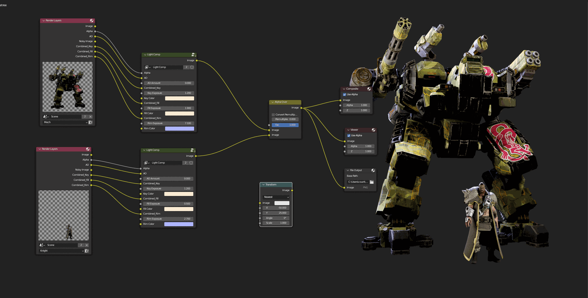
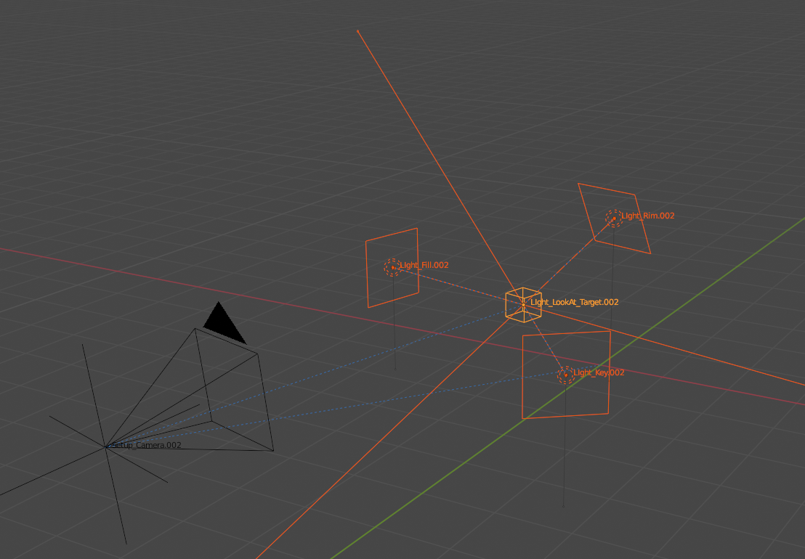
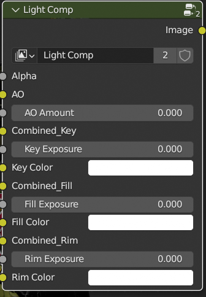
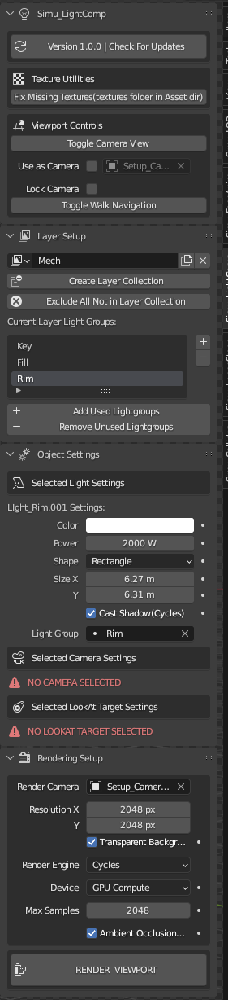

# Example Overview
I did some testing to see if compositing marketing images inside of Blender was viable. This is an unfinished exploration addon. It allows you to render multiple objects into a separate layer, each with it's own lighting that will not interfere with other layers. You can then use a node function I put together to composite each layer into a single image. It has controls for each light color and exposure strength. I also builg a light rig for easy positioning with a central target for both the camera and lights.

 

## Composite Output

## Light Rig

## Node Group

## Addon Panel(not shown in GIF)
) 

