# Example Overview
Below you will find the actual documentation used in production. This example was a test of Blender's new Geometry Node procedural workflow. It was useful enough for production needs, but in hindsight I believe it had too many steps to setup a work session. If I had to do it over again I would use Blender's Bmesh Python module to generate colliders programatically. The addon can be intalled manually or linked in the same fashion as described, but must link to an actual folder on your PC. The asset library steps are not needed as the node group is already present in the provided example Blender file.

 
***
# START OF PRODUCTION DOCS(links broken)
# Simu_Collider Help and Information
## Quick Links
- [Getting started](https://github.com/JMTechArt/Pipeline-Examples/blob/main/Blender%20Addons/addons/Simu_Collider/READ_ME.md#getting-started)

    - [Add-on Installation Procedure](https://github.com/JMTechArt/Pipeline-Examples/blob/main/Blender%20Addons/addons/Simu_Collider/READ_ME.md#add-on-installation-procedure)

    - [Panel Location, Versioning, and Help](https://github.com/JMTechArt/Pipeline-Examples/blob/main/Blender%20Addons/addons/Simu_Collider/READ_ME.md#panel-location-versioning-and-help)

- [Collider Workflow](https://github.com/JMTechArt/Pipeline-Examples/blob/main/Blender%20Addons/addons/Simu_Collider/READ_ME.md#collider-workflow)

    - [Collider Setup](https://github.com/JMTechArt/Pipeline-Examples/blob/main/Blender%20Addons/addons/Simu_Collider/READ_ME.md#collider-setup)

    - [Collider Tools](https://github.com/JMTechArt/Pipeline-Examples/blob/main/Blender%20Addons/addons/Simu_Collider/READ_ME.md#collider-tools)

- [Unity Script](https://github.com/JMTechArt/Pipeline-Examples/blob/main/Blender%20Addons/addons/Simu_Collider/READ_ME.md#unity-script)

    # Getting Started
## Add-on Installation Procedure
1. Before installation make sure you have Blender 3.1 or later.
    - This can be found on [Blender.org's Download Page](https://www.blender.org/download/)

2. Open Blender and navigate to Edit>Preferences>File Paths.
    - Inside the Data section and in the Scripts directory path you will have to search and find the following directory inside the Simutronic's git repository that you have cloned to your PC:
        > \Galahad\3DArtTools\Blender\scripts\

        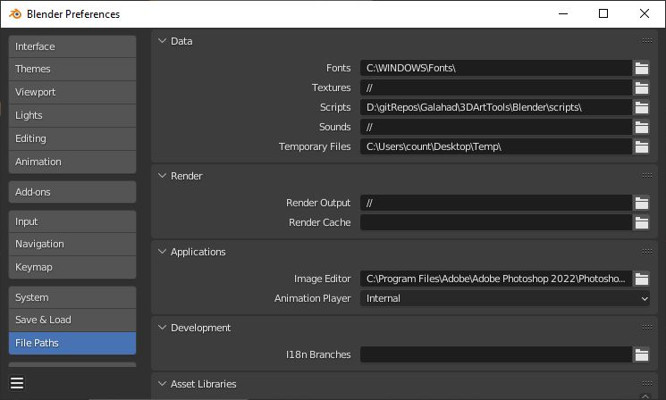
3. In the same preferences tab add the following directory to the Asset Libraries section:'
    > Your Drive Letter:\Dropbox (Simutronics)\Blender Asset Libraries\

    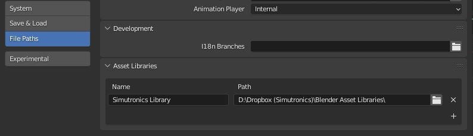

        

4. Close all instances of the Blender application. This is **NOT** optional.

5. Reopen Blender and again, in Edit>Preferences navigate to Add-ons.
    - Search for Simutronics
    - Click the checkbox next to Simu_LOD to enable this add-on

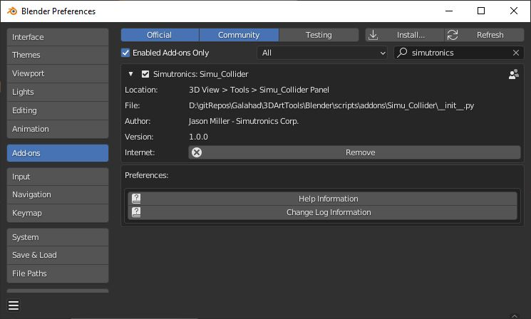

Setup is now complete and you will only have to enable new add-ons by searching for Simutronics in the same fashion in the future. Add-on updating will happen as you sync with the git repository. The directory you added will house all future Blender add-ons.

## Panel Location, Versioning, and Help
In the 3D Viewport you will find a tab labled Simu_LOD. If you do not see any tabs, press the 'N' key on your keyboard to open up the tab sidebar.

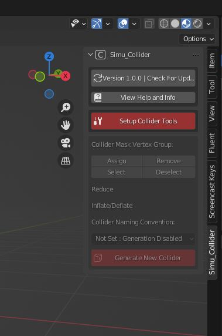 

The top-most button on the panel has a label that lists the current version of the add-on that is installed. This also functions as a button to check for add-on updates after you resync the git repository. Updating while Blender is running is completely fine.

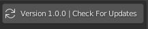

The next button below will link to this READ_ME.md file that you are currently reading in case you need help.

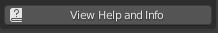

# Collider Workflow

## Collider Setup

By default, Blender has a dedicated Geometry Nodes tab and it is a good idea to switch to that for setup. Do the following:

1. Click on the 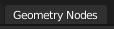  tab at the top of the Blender UI.

2. The 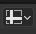 Spreadsheet is not needed, you can switch to the 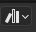 Asset Library view. 

3. In the Asset Library window, swap the mode from 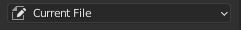 to 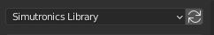

4. Make sure you have Viewport Shading set to 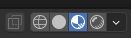 Material Preview mode.

5. Select the object you wish to create a collider for and then click the 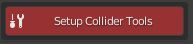 button.

6. Mulitple things happen when you click that button, one of them is the creation of a Geometry Nodes network labeled as 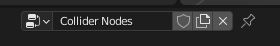

7. Drag the Simu_Collider asset from the Asset Browser window and into the Collider Nodes network.

    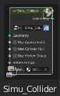

8. You need to connect Simu_Collider connections to the Group Input and Group Output. The minimun required connections are the Geometry Input/Output connections and the Vertex Group Input connection. All other are optional and can be toggled on and off in the node it self.

    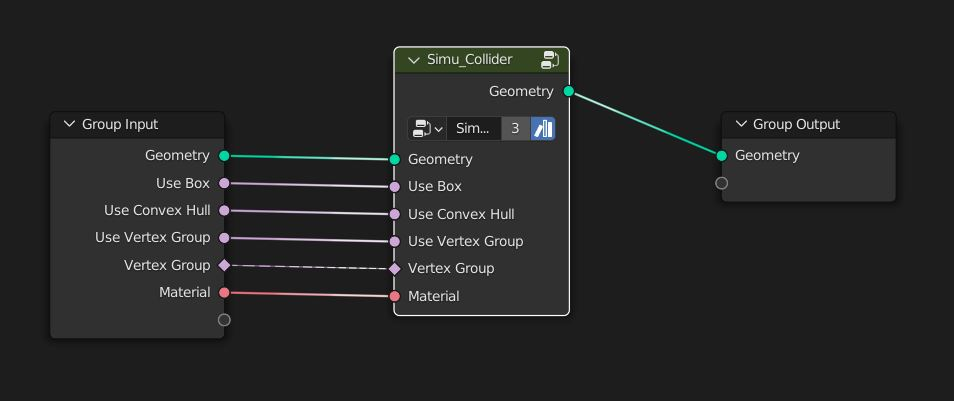

9. In the 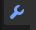 Modifier Properties tab you will see the UI in the Geometry Nodes modifier that was created by making those node connections.
    
    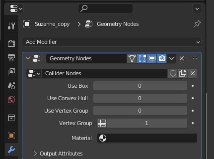

10. Click the 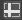 icon and switch it to Point>Collider Mask

11. Click 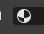 icon and switch it to Collider_Setup_Mat. If you did not make this node connection, you will have to set the material in the node window instead.

12. Setup is now complete. This will show all the steps in order:

   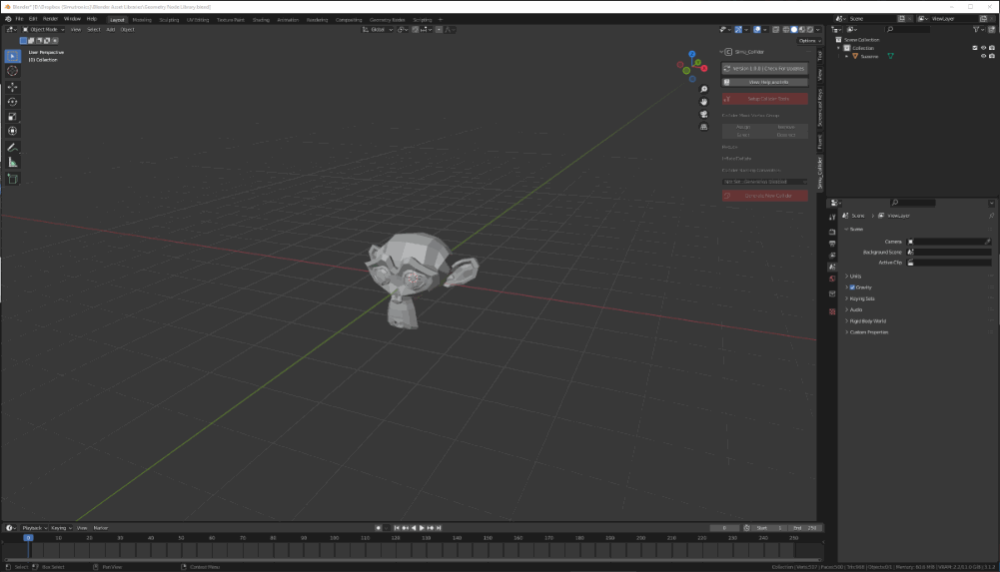

## Collider Tools

Remain on the  Modifier Properties tab. You will be using both the Add-on panel and this tab for creating colliders. 

Use the Geometry Nodes modifier panel to pick the type of collider you wish to create. 

- Swap the 0 for a 1 for Use Box or Use Convex Hull to toggle those options. 
- A Mesh collider will be generated if these are both set to 0. 
- Toggle Use Vertex Groups to use vertex grouping to create colliders on only parts of a model instead of the entire model.

    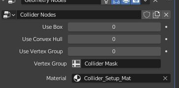

If using a Vertex Group to create a collider for only a portion of a mesh, the Add-on panel has the Vertex Group tools available when in Edit mode in Blender. 
- The same exact tools are in the 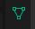 Data Properties panel, but are in the add-on for convenience. 

    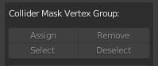

If you are creating a mesh collider, or, in some cases, a convex hull collider, you will want to use the Reduce slider to decrease overall vertex count for game performance reasons. 
- This is a convenience slider, it is identical to the Decimate modifier's Ratio slider in the Modifier Properties panel.

    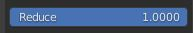

    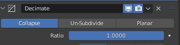

After reducing the vertices, you may need to inflate or deflate the collider mesh to get the best possible fitment. The Inflate/Deflate slider does exactly this.
- This is identical to the Strength slider in the in the Displace modifier in the Modifier Properties panel.

    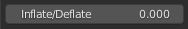

    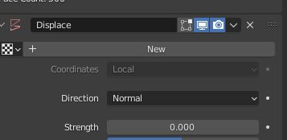

After the collider mesh is configured as needed, you need to choose a naming convention. By default, this dropdown menu is set to 'Not Set: Generation Disabled' and the red Generate New Collider button is disabled.

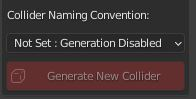

The options are:
1. Box:UBX
2. Convex Hull:UCX
3. Mesh:UMC

Once the proper type has been selected the Generate New Collider will be enabled.

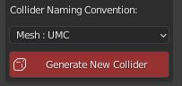

After pressing that button, the collider mesh will adopt the proper naming convention automatically, change it's material from blue to yellow, and remove all of the modifiers. The add-on panel will also reset in case you need to process more mesh parts.

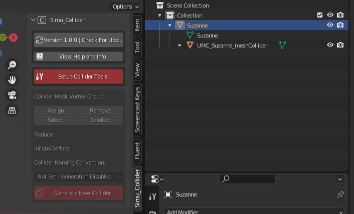

**WARNING: DO NOT rename the colliders and remove the prefix, the Unity script is dependant on naming conventions!**

# Unity Script

After selecting the mesh and all of it's colliders. Export them to Unity. Create a prefab that includes the mesh and all of the colliders. 

- With the new prefab selected go to Tools>Generate Collision. 

- A UI will pop up and allow you to select the Physics Material and Object Layer before you click the Generate button to generate Unity readable colliders based on the generated colliders that were made in Blender.

    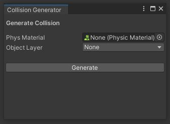