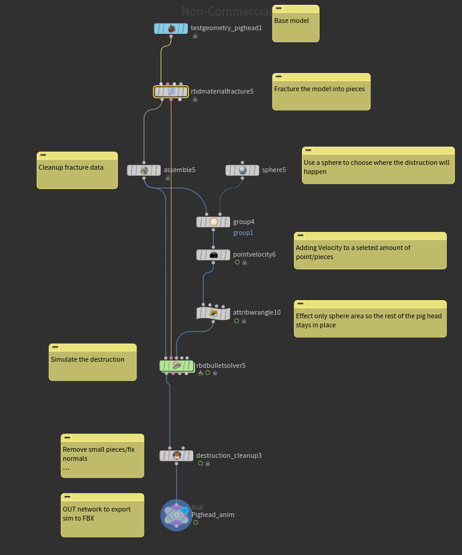

# Example Overview
[File Link](https://github.com/JMTechArt/Pipeline-Examples/tree/main/Houdini/Destruction%20Example)

This is an example what Houdini can easily accomplish with a few nodes. This network takes any model and uses another 3D object as a volume to apply a destruction effect to that area. Typically you would export this as either a FBX keyframe animation or use something like Vertex Animation Textures(VAT) in a game engine.

Here is the node layout. 

