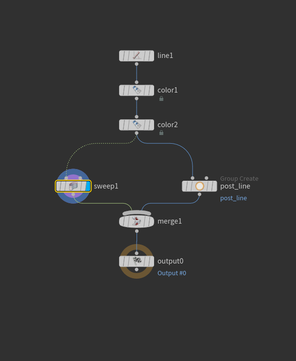
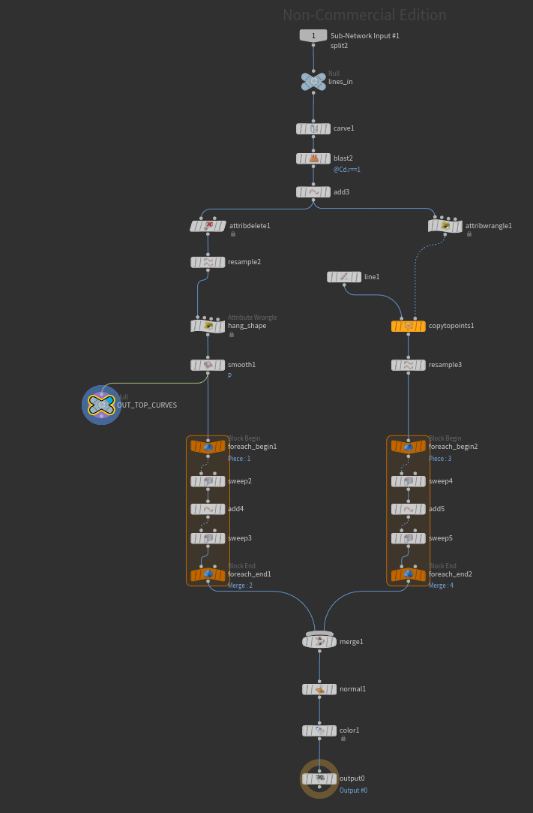

# Example Overview
This is an example of a Houdini Digital Asset(HDA). This is what you would use in a game engine if you're using a Houdini Engine plugin. Great for when you need a lot of variation using the same basic template.

Here is the main node layout. It has subnetworks for each component. 

Posts

Planks

Rope

