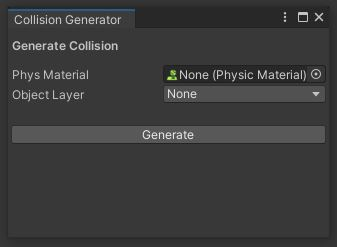

# Example Overview
[Code Link](https://github.com/JMTechArt/Pipeline-Examples/tree/main/Unity/Collider%20Generator)

This is a simple Unity Editor script designed to work in conjunction with the Blender Simu-Collider script. It takes the string name generated in Blender of procedurally generated 3D Meshes and creates the appropriate collider components. It also has extra functionality to set any preexisting physics material and game object layer. Full instructions in the Simu_Collider READ_ME.md(found in link above).

## Quick Links
- [Blender Simu_Collider Addon Link](https://github.com/JMTechArt/Pipeline-Examples/tree/main/Blender%20Addons/addons/Simu_Collider)

