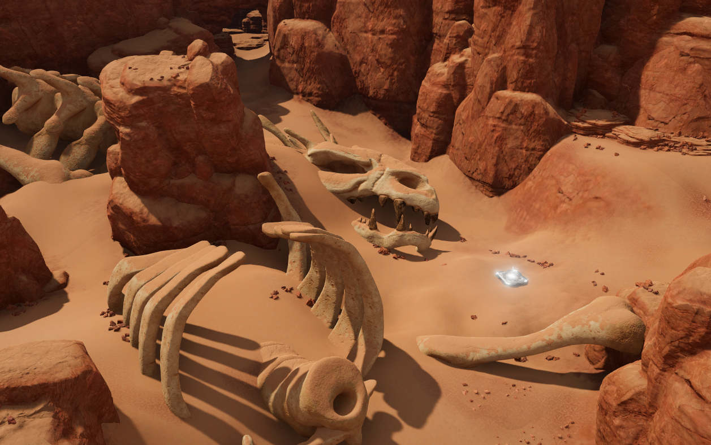
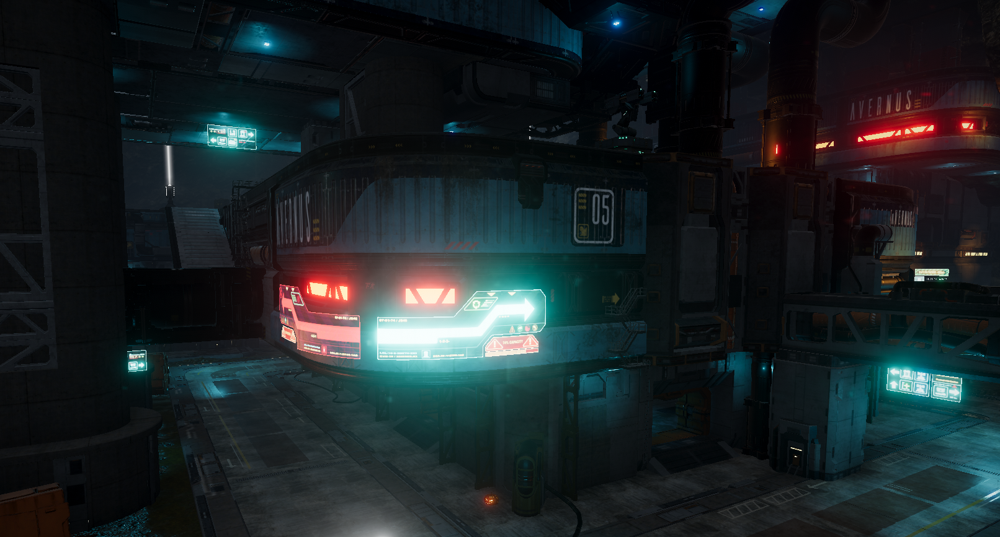

# Example Overview
I have written countless shaders over the years. Here is a few examples from my most recent professional project.

# Sand Shader Example
We had a desert level in a project and needed sand to appear on objects. I sculpted this dragon skull to test edge cases where the shader might fail and it ended up staying in the game. Triplanar example where sand only appears on the top regarless of object rotation. I used Amplify for shader editing. Unity's Shader Graph didn't exist yet. Large object, players were able to walk underneath the skeleton parts.

 
 

# Holographic Shader
We had holographic signage in levels. This is a flipbook shader that accounts for a variety of column and row settings for different texture inputs, both static and animated. This GIF does not represent the final quality due to colors being limited to a maximum of 256. It only shows the animation.

 
 
