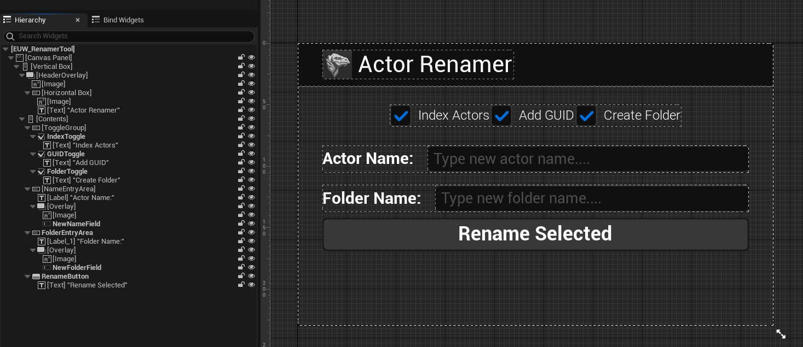

# Example Overview
Blueprint example of a utility widget. This renames any selected actor with what you type into a field. It lets you use the array index to enumerate check actor. It also allows you to append the GUID at the end of the name because I couldn't think of anything else to do. There is also an option to create a folder to house all the newly renamed actors. There are no files to look at for this since it is not "code" and would require repository clone with large Unreal project files to share. Only this READ_ME.

## Widget UI
A basic UI layout with checkboxes set to be variables, text input fields, and a single button. The Folder text field is not visible if the Create Folder checkbox is not checked.

## Main Event Graph
Checks whether the user has selected any actors or not. It shows a popup messase asking the user to do so if not. If the user has a selection, it starts a sequence that handles the renaming process. The renaming processes are in collapsed graphs to keep things easily readable. The Folder text field toggle is also in this graph in the red comment box.

## Name Validation Graph
Checks whether the user has typed into the rename field or not. It shows a popup message asking the user to do so if not. It also sets bool value to be used in the rest of the widge logic.

## Renaming Graph
Checks what the user typed into the rename text field and applies the new label to all selected actors while appending index numbers and/or GUID text if toggled to do so. GUID text is always last.

## Folder Graph
If the Create Folder checkbox is checked this graph will check to see if a name was entered for the new folder. If not, it will show a pop up message asking the user to enter a name in the folder text field. If text was entered by the user then all selected actors will be placed in the newly created folder.
